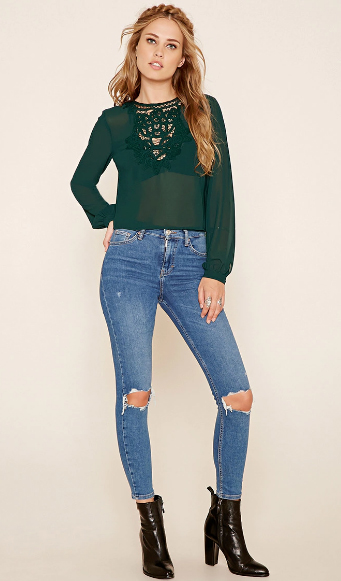
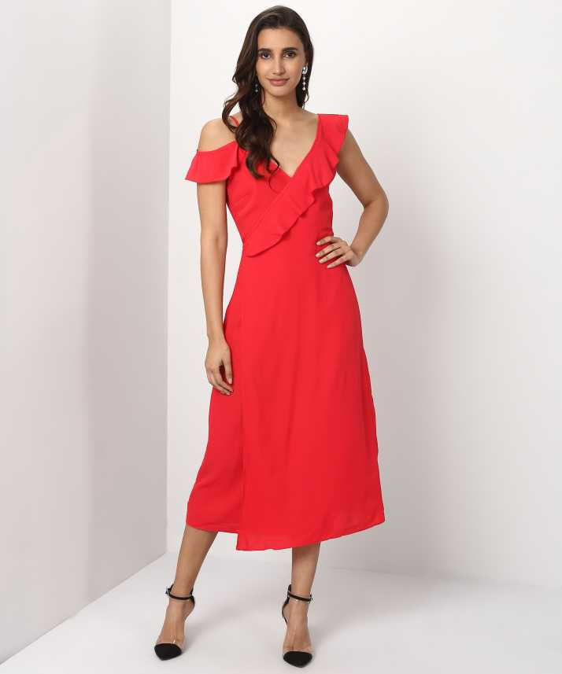

# Apparel_Color_detection
This project focusses on detecting the apparel which may be dress , tops or jeans and following that it would identify the color of the apparel which may be green , blue or red. 

## Table of contents
* [General info](#general-info)
* [Project Structure](#project_str)
* [Dataset](#data)
* [Project Execution Steps](#project)
* [Flask App](#flask)
* [Result Images](#images)
* [Future Work](#future)

<a name="general-info"></a>
## General info
The objective of this project is to develop a working model that can automatically identify the apparel types given an image and also identify its colors. To mantain the sanity and complexity of the dataset , the apparel is restricted to dresss,tops and jeans while color is restricted to red, blue and green. It is targeted to serve as an automatic apparel recognition api.


The dataset used for this model was the **[cloths dataset](https://drive.google.com/open?id=1aj-umzIq9ujQTGnUae__MVgwjTWxviSP)**. This dataset was collected from the net as we wanted aa custom dataset whoch catered to these 3 apparels only.If you face downloading the dataset , do drop me a mail to gain the access credentials.

So, in the image recognition api , at the first stage the apparel is detected and identified. So we have used object detection technique for this module. We used **Tensorflow Object Detection** api to train the model in accordance to our custom dataset. The architecture used for training the model was **SSD - Mobilenet** architecture which gave us a very good IOU and also a very good classification accuracy on the test unseen dataset.

In the next stage after the apparel is identified , the cropped part of the image is taken out which is being extracted using the information of the bounding box givne from the object detection module. This cropped part of the image is then givne toi **image classification module** which identifies the color of the apparel accordingly which may be red , blue or green.

**XceptionNet** was used as a pretrained model which was further fine tuned for our custom image recognition engine. The color recognition module was giving a test accuracy of around **99.1%** which is very promising.

All the codes for the project is kept in the src folder and the common scripts are kept in the scripts folder.

Current validation accuracy for the apparel detection stands at **94%** which can be further improved if trained for a larger period of time. Due to time constraints , further hyper-parameter optimisation for the network could not be done.


<a name="project_str"></a>
## Project Structure

The entire project structure is as follows:

```
├── config
│   └── config.json
├── data
├── examples
│   ├── image_1.jpg
│   ├── image_2.jpg
│   ├── image_3.jpg
│   ├── image_4.jpg
│   ├── image_5.jpg
│   ├── image_6.jpg
│   ├── image_7.jpg
│   ├── image_8.jpg
│   └── image_9.jpg
|   .......
├── models
│   ├── apparel_detector.pb
│   ├── apparel_labels.pbtxt
│   └── color_model.h5
├── output
│   └── output.csv
├── src
│   ├── apparel_color_classify.py
│   ├── apparel_color_classify_all_images.py
│   ├── apparel_color_detector.py
│   ├── apparel_detector.py
│   ├── color_detector.py
│   └── get_product_details.py
├── test
├── utils
│   │   └── utils.cpython-36.pyc
│   ├── string_int_label_map_pb2.py
│   └── utils.py
├── app.py
├── requirements.txt
└── test_apparel_classifier.py

```
As we see from the project structure :

a) all the class related to apparel detector and color detector are kept in **src** folder. 

b)The test images are kept in examples folder. 

c) The configurable parameters like model loading path , threshold , test image path are kept in **config.json** file

d) All the trained models and tits label files are kept in **models** folder

e) The utilities or helper functions which are required throughout the project are kept in utils.py inside **utils** folder

f) **app.py** was written for a flask python wrapper to start the server kernel. Also the **test_classifier.py** is on the client side to test it given a web based api


<a name="data"></a>
## Dataset

The dataset for this challenge was a custom made dataset which was extracted from the net [cloth dataset](https://drive.google.com/open?id=1aj-umzIq9ujQTGnUae__MVgwjTWxviSP)

The Clothing dataset contains 810 images of around 270 images of each class. The data is split into 720 training images and 81 testing images. As the challenge clearly stated just to take the training dataset for preparing the model , only the  containing 720 inages were taken for training our model.
The meta data information are the label annotations that were donw using LabelImg which gaves us the bounding box required to train our object detection module.

<a name="project"></a>
## Project Execution Steps to run the Inference scripts

**Step 1. Clone the entire project**

* The entire project needs to be cloned into your machine. Once it is cloned we go to that project structure and type in terminal as:

```
export PYTHONPATH=.
```
* We need to install the dependencies required for this project. The dependencies are given in **requirements.txt** file 

**Step 2. Deliverables requirement 1 : Getting the output results given an input image**

* In order to see the output given an input image, type in the following command in the terminal as:

```
python src/apparel_color_classify.py --image examples/image_11.jpg 
```

* As we can see the images for testing are kept in examples folder. To test it for varying images , you can change the image name accordingly in the terminal. In case you want to test it for your test image, copy the image inside examples folder and then run the scipt changing the image name 

* Since image_11.jpg was given. The image is shown below:

<div style="text-align: center"></div>

Once we run the script above the results displayed is as such:

```

################ PRINTING THE RESULTS ###############
Products found: 2
Product_1: jeans
Confidence score: 99.63%
Predicted color: blue
Blue : 99.98%  Green : 0.01%  Red : 0.01%
Product_2: tops
Confidence score: 95.10%
Predicted color: green
Blue : 0.10%  Green : 99.89%  Red : 0.00%

```

As you can see it has identified 2 products Jeans and Tops and also could predict the color of each apparel.
You can try out different images

Another example is as follows:

image_3.jpg . The image is as follows:

<div style="text-align: center"></div>

The output is as follows:
```
################ PRINTING THE RESULTS ###############
Products found: 1
Product_1: dress
Confidence score: 100.00%
Predicted color: red
Blue : 0.00%  Green : 0.00%  Red : 100.00%

```

**Step 3. Deliverables requirement 2 : Getting the output results in csv file runnning it in a batch of images**

So now if we want to run it in a batch of images, run the following script in the terminal which will generate a csv file inside the **output** folder 

```
python src/apparel_color_classify_all_images.py 

```
The output of the csv file looks like this:
```
Image_Name,Number_of_Clothing,Product_Type,Blue,Green,Red
image_15.jpg,1,tops,0.3238868433982134,99.67573285102844,0.000378599042960559
image_14.jpg,1,tops,99.86935257911682,0.11679723393172026,0.01386233780067414
image_16.jpg,2,jeans,99.87934827804565,0.11974158696830273,0.0009089585546462331
image_16.jpg,2,tops,0.01001568089122884,8.12824396234646e-05,99.98990297317505
image_13.jpg,2,jeans,99.81548190116882,0.17992547946050763,0.0045972534280736
image_13.jpg,2,tops,3.9661794900894165,11.283758282661438,84.75006222724915
image_12.jpg,1,tops,0.0010981624654959887,1.8325655659623408e-06,99.99890327453613
image_10.jpg,1,jeans,99.97773766517639,0.021576619474217296,0.0006866517651360482
image_11.jpg,2,jeans,99.98176693916321,0.0077021264587529,0.01053789455909282
image_11.jpg,2,tops,0.1007411046884954,99.89472031593323,0.004539237488643266
image_8.jpg,1,jeans,99.88386034965515,0.11542949359863997,0.0007122881925170077
image_9.jpg,1,tops,0.09494504774920642,99.89076852798462,0.01428483083145693
image_2.jpg,1,tops,97.70727157592773,0.00011822950227724505,2.2926123812794685
image_3.jpg,1,dress,8.949840868410774e-08,2.3048234432110348e-07,100.0
image_1.jpg,1,tops,0.08096584351733327,99.91710186004639,0.0019310218704049475
image_4.jpg,1,tops,0.016509876877535135,0.00011589934274525149,99.98337030410767
image_5.jpg,1,jeans,0.5876200273633003,0.006450073124142364,99.40593242645264
image_7.jpg,1,dress,5.751730129122734,93.93219351768494,0.31607006676495075
image_6.jpg,1,dress,0.01206130109494552,99.982750415802,0.0051802238886011764
```
You can copy all your images inside the **examples** folder and run the above script to generate the output in a csv file.

<a name="flask"></a>
## Flask App

**Deliverables requirement 4 : Making a REST api to check it for images in the web**

I have also created a flask app which would take an image and give recognition in real time. To run the flask app below is the steps

a) Go to the project structure
b) In a terminal run

```
python app.py
```

c) In another terminal , run **test_production.py** to see the output. The command is as follows:
```
python test_apparel_classifier.py 

```

The output for the app would look somewhat like this:
```
{
"Product_1":"jeans",
"Product_1_color_percentages":"Blue : 99.98%  Green : 0.01%  Red : 0.01%",
"Product_1_confidence":99.4613528251648,
"Product_1_name":"jeans",
"Product_1_predicted color":"blue",
"Product_2":"tops",
"Product_2_color_percentages":"Blue : 0.13%  Green : 99.87%  Red : 0.00%",
"Product_2_confidence":95.71353197097778,
"Product_2_name":"tops",
"Product_2_predicted color":"green",
"number_of_products":2
}
```
